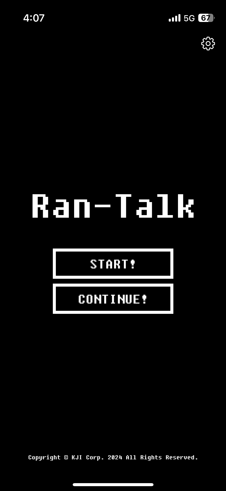
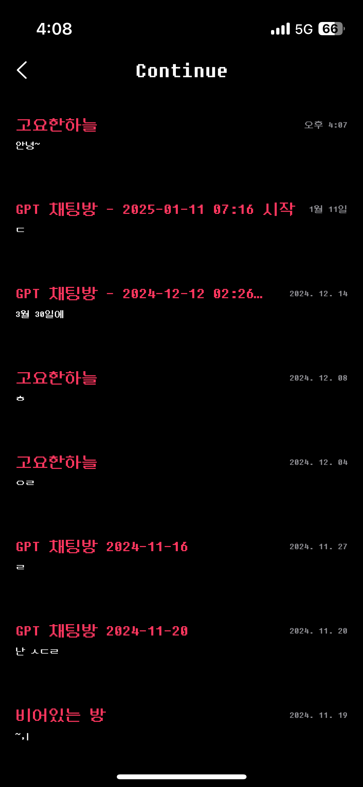
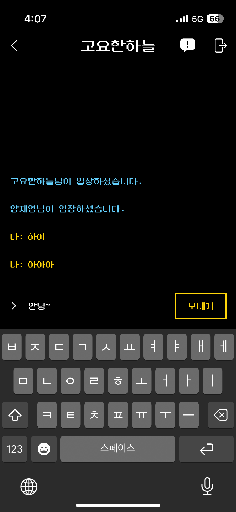
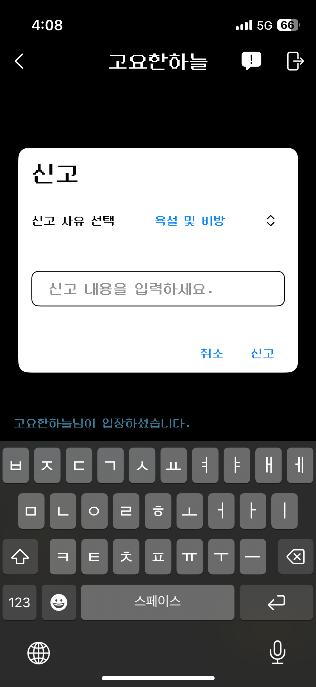
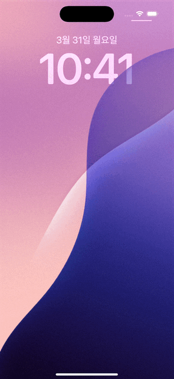
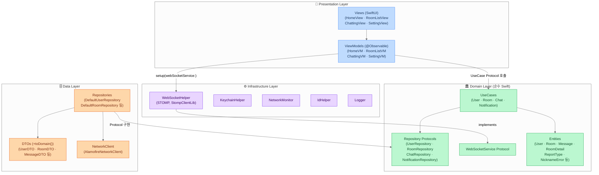

# 랜톡 (Ran-Talk)

> 랜덤 매칭 기반 익명 실시간 채팅 iOS 앱

  

<br>

## 스크린샷

| 홈 | 채팅방 목록 | 채팅 |
|:---:|:---:|:---:|
|  |  |  |

| 신고 | 푸시 알림 딥링크 |
|:---:|:---:|
|  |  |

<br>

## 주요 기능

| 기능 | 설명 |
|------|------|
| 랜덤 매칭 | START 버튼으로 랜덤 사용자와 즉시 매칭 |
| AI 매칭 | 8초 내 상대가 없으면 GPT와 대화하는 방 자동 생성 |
| 실시간 채팅 | WebSocket STOMP 기반 메시지 송수신, 발신 시간 표시, 무한 스크롤 |
| 채팅방 목록 | 기존 매칭된 방 재입장, Pull-to-Refresh |
| 사용자 신고 | 채팅 상대방 신고 (스팸·욕설·광고·허위정보·저작권 침해·기타) |
| 설정 | 닉네임 변경, 푸시 알림 ON/OFF |
| 푸시 알림 | FCM 기반 메시지 수신 알림, 탭 시 해당 채팅방으로 딥링크 이동 |
| 보안 | iOS Keychain Services를 이용한 userId 암호화 저장 |

<br>

## 기술 스택

| 분류 | 사용 기술 |
|------|----------|
| 언어 | Swift |
| UI | SwiftUI |
| 아키텍처 | Clean Architecture (MVVM + UseCase + Repository) |
| 상태 관리 | @Observable (Swift Observation) |
| 비동기 | async/await, @MainActor |
| 네트워크 | Alamofire |
| WebSocket | StompClientLib (STOMP 프로토콜) |
| 보안 | iOS Keychain Services |
| 푸시 알림 | Firebase Cloud Messaging (FCM) |
| 테스트 | Swift Testing (`@Test`, `#expect`) |
| 의존성 관리 | CocoaPods, Swift Package Manager |

<br>

## 아키텍처



**Clean Architecture 4계층**

| 계층 | 위치 | 역할 | 의존 규칙 |
|---|---|---|---|
| Domain | `ranchat/Domain/` | 비즈니스 로직, UseCase, Repository 프로토콜 | Foundation만 |
| Data | `ranchat/Data/` | REST API, DTO 변환, Repository 구현 | Domain, Alamofire |
| Infrastructure | `ranchat/Infrastructure/` | WebSocket, Keychain, NetworkMonitor | Domain 서비스 프로토콜 |
| Presentation | `ranchat/Presentation/` | SwiftUI View, @Observable ViewModel | Domain UseCase/Entity |

**WebSocket Callback 패턴**

`WebSocketHelper(Infrastructure)`가 `ChattingViewModel(Presentation)`을 직접 참조하는 계층 위반을 callback 패턴으로 해결했습니다.

```swift
// Before (위반 — Infrastructure → Presentation 직접 참조)
class WebSocketHelper {
    weak var chattingViewModel: ChattingViewModel?
}

// After (callback 역전)
protocol WebSocketService {
    func setOnMessageReceived(_ handler: @escaping @MainActor (Message) -> Void)
}

// ViewModel에서 등록
webSocketService.setOnMessageReceived { [weak self] message in
    self?.messageDataList.insert(message, at: 0)
}
```

**UseCase 의존성 주입**

ViewModel은 UseCase 프로토콜만 의존해 프로덕션과 테스트 코드 변경 없이 교체 가능합니다.

```swift
// 프로덕션은 Default, 테스트는 Mock UseCase 주입
init(
    checkRoomExistUseCase: any CheckRoomExistUseCase = DefaultCheckRoomExistUseCase(),
    createRoomUseCase: any CreateRoomUseCase = DefaultCreateRoomUseCase()
) { ... }
```

**보안**

`@AppStorage`(UserDefaults 평문)로 저장하던 userId를 iOS Keychain Services로 마이그레이션했습니다.

```swift
KeychainHelper.shared.saveUserId(uuid)
KeychainHelper.shared.getUserId()
```

<br>

## 프로젝트 구조

```
ranchat/
├── Domain/
│   ├── Entity/           # User, Room, RoomDetail, Message, RoomPage, MessagePage
│   │                     # RoomType, MessageType, NicknameError, ReportType
│   ├── Repository/       # UserRepository, RoomRepository, ChatRepository, NotificationRepository
│   ├── Service/          # WebSocketService 프로토콜, WebSocketServiceError
│   └── UseCase/
│       ├── User/         # CreateUser, GetUser, UpdateUserName, ValidateNickname
│       ├── Room/         # CheckRoomExist, CreateRoom, GetRooms, GetRoomDetail
│       ├── Chat/         # GetMessages, ReportUser
│       └── Notification/ # CreateNotification, UpdateNotification
├── Data/
│   ├── DTO/              # ApiResponseDTO, UserDTO, RoomDTO, RoomDetailDTO,
│   │                     # MessageDTO, RoomPageDTO, MessagePageDTO (+toDomain())
│   ├── DataSource/       # NetworkClient 프로토콜 + AlamofireNetworkClient
│   ├── LocalStorage/     # SearchKeyword
│   └── Repository/       # DefaultUserRepository, DefaultRoomRepository,
│                         # DefaultChatRepository, DefaultNotificationRepository
├── Infrastructure/
│   ├── WebSocket/        # WebSocketHelper (WebSocketService 구현, STOMP)
│   ├── Keychain/         # KeychainHelper
│   ├── Network/          # NetworkMonitor, DefaultData
│   ├── Session/          # IdHelper
│   └── Logger/           # Logger
└── Presentation/
    ├── Home/             # HomeView, HomeViewModel
    ├── RoomList/         # RoomListView, RoomListViewModel
    ├── Chatting/         # ChattingView, ChattingViewModel
    ├── Setting/          # SettingView, SettingViewModel
    ├── Common/           # CenterLoadingView, DialogViewModifier, ...
    └── Extension/        # Font+DungGeunMo, UINavigationController+
```

<br>

## 실행 방법

```bash
# 의존성 설치
pod install

# Xcode에서 열기 (반드시 .xcworkspace 사용)
open ranchat.xcworkspace
```

> ⚠️ `GoogleService-Info.plist` 및 Firebase 설정은 별도 제공이 필요합니다.

> ⚠️ 현재 서버가 운영 중이지 않아 실제 매칭 및 채팅 기능은 동작하지 않습니다.
