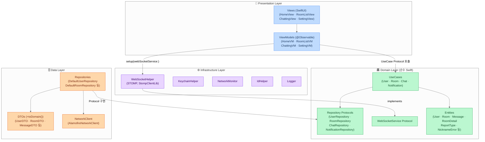

# 랜톡 (Ran-Talk)

> 익명 랜덤 매칭 실시간 채팅 iOS 앱

  

<br>

## 스크린샷

| 홈 | 채팅방 목록 | 채팅 | 신고 |
|:---:|:---:|:---:|:---:|
|  |  |  |  |

| 푸시 알림 딥링크 |
|:---:|
|  |

<br>

## 주요 기능

| 기능 | 설명 |
|------|------|
| 랜덤 매칭 | START 버튼으로 랜덤 사용자와 즉시 매칭 |
| AI 매칭 | 8초 내 상대가 없으면 GPT와 대화하는 방 자동 생성 |
| 채팅 | 실시간 메시지 송수신, 발신 시간 표시, 무한 스크롤 |
| 채팅방 목록 | 기존 매칭된 방 재입장, Pull-to-Refresh |
| 신고 | 채팅 상대방 신고 (스팸·욕설·광고 등 분류) |
| 설정 | 닉네임 변경, 푸시 알림 ON/OFF |
| 푸시 알림 | FCM 기반 메시지 수신 알림, 탭 시 채팅방 목록으로 딥링크 이동 |

<br>

## 기술 스택

| 분류 | 사용 기술 |
|------|----------|
| 언어 | Swift 5.9 |
| UI | SwiftUI |
| 아키텍처 | Clean Architecture (MVVM + UseCase + Repository) |
| 상태 관리 | @Observable (Swift Observation) |
| 비동기 | async/await, @MainActor |
| 네트워크 | Alamofire, WebSocket (STOMP / StompClientLib) |
| 보안 | Keychain Services |
| 푸시 알림 | Firebase Cloud Messaging (FCM) |
| 테스트 | Swift Testing (`@Test`, `#expect`) |
| 의존성 관리 | CocoaPods, Swift Package Manager |

<br>

## 아키텍처



**WebSocket Callback 패턴**

기존 구조는 `WebSocketHelper(Infrastructure)`가 `ChattingViewModel(Presentation)`을 직접 참조하는 의존성 위반이 있었습니다. callback 패턴으로 방향을 역전했습니다.

```swift
// Before (위반 — Infrastructure → Presentation 직접 참조)
class WebSocketHelper {
    weak var chattingViewModel: ChattingViewModel?
}

// After (callback 역전)
protocol WebSocketService {
    func setOnMessageReceived(_ handler: @escaping @MainActor (Message) -> Void)
}

// ViewModel에서 등록
webSocketService.setOnMessageReceived { [weak self] message in
    self?.messageDataList.insert(message, at: 0)
}
```

**UseCase 의존성 주입**

ViewModel은 UseCase 프로토콜만 의존하여 프로덕션과 테스트 코드 변경 없이 교체 가능합니다.

```swift
// 프로덕션은 Default, 테스트는 Mock UseCase 주입
init(
    checkRoomExistUseCase: any CheckRoomExistUseCase = DefaultCheckRoomExistUseCase(),
    createRoomUseCase: any CreateRoomUseCase = DefaultCreateRoomUseCase()
) { ... }
```

**보안**

`@AppStorage`(UserDefaults 평문)로 저장하던 userId를 iOS Keychain으로 마이그레이션했습니다.

```swift
KeychainHelper.shared.saveUserId(uuid)
KeychainHelper.shared.getUserId()
```

<br>

## 프로젝트 구조

```
ranchat/
├── Domain/
│   ├── Entity/          # User, Room, RoomDetail, Message, RoomPage, MessagePage
│   │                    # RoomType, MessageType, NicknameError, ReportType
│   ├── Repository/      # UserRepository, RoomRepository, ChatRepository, NotificationRepository
│   ├── Service/         # WebSocketService 프로토콜, WebSocketServiceError
│   └── UseCase/
│       ├── User/        # CreateUser, GetUser, UpdateUserName, ValidateNickname
│       ├── Room/        # CheckRoomExist, CreateRoom, GetRooms, GetRoomDetail
│       ├── Chat/        # GetMessages, ReportUser
│       └── Notification/ # CreateNotification, UpdateNotification
├── Data/
│   ├── DTO/             # ApiResponseDTO, UserDTO, RoomDTO, RoomDetailDTO,
│   │                    # MessageDTO, RoomPageDTO, MessagePageDTO (+toDomain())
│   ├── DataSource/      # NetworkClient 프로토콜 + AlamofireNetworkClient
│   ├── LocalStorage/    # SearchKeyword
│   └── Repository/      # DefaultUserRepository, DefaultRoomRepository,
│                        # DefaultChatRepository, DefaultNotificationRepository
├── Infrastructure/
│   ├── WebSocket/       # WebSocketHelper (WebSocketService 구현, STOMP)
│   ├── Keychain/        # KeychainHelper
│   ├── Network/         # NetworkMonitor, DefaultData
│   ├── Session/         # IdHelper
│   └── Logger/          # Logger
└── Presentation/
    ├── Home/            # HomeView, HomeViewModel
    ├── RoomList/        # RoomListView, RoomListViewModel
    ├── Chatting/        # ChattingView, ChattingViewModel
    ├── Setting/         # SettingView, SettingViewModel
    ├── Common/          # CenterLoadingView, DialogViewModifier, ...
    └── Extension/       # Font+DungGeunMo, UINavigationController+

Tests/ranchatTests/
├── Mock/
│   ├── MockCheckRoomExistUseCase.swift  MockCreateRoomUseCase.swift
│   ├── MockCreateUserUseCase.swift      MockGetRoomsUseCase.swift
│   ├── MockGetRoomDetailUseCase.swift   MockGetMessagesUseCase.swift
│   ├── MockGetUserUseCase.swift         MockUpdateUserNameUseCase.swift
│   ├── MockValidateNicknameUseCase.swift MockReportUserUseCase.swift
│   ├── MockWebSocketService.swift
│   ├── MockUserRepository.swift  MockRoomRepository.swift  MockChatRepository.swift
├── HomeViewModelTests.swift
├── RoomListViewModelTests.swift
├── ChattingViewModelTests.swift
├── SettingViewModelTests.swift
└── ValidateNicknameUseCaseTests.swift
```

<br>

## 🚀 실행 방법

```bash
# 의존성 설치
pod install

# Xcode에서 열기
open ranchat.xcworkspace
```

> ⚠️ `GoogleService-Info.plist` 및 Firebase 설정은 별도 제공이 필요합니다.
